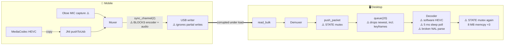
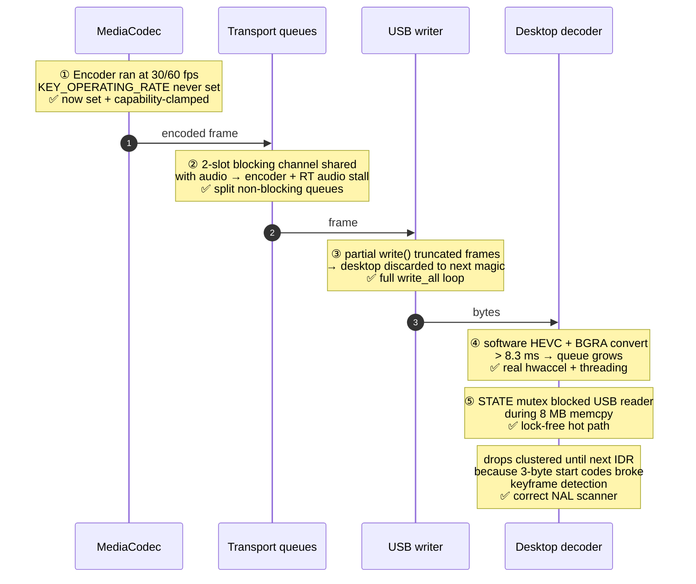

# ScreenMirror — Code Review & Pipeline Overhaul

**Original review:** 2026-07-25 · **Fixes applied:** 2026-07-25
**Scope:** `desktopApp` (Electrobun + Rust backend), `mobileApp` (Flutter + Kotlin + Rust), OBS plugin, platform driver automation.

---

## Table of Contents

1. [Status Summary](#1-status-summary)
2. [Architecture — Before and After](#2-architecture--before-and-after)
3. [The 120 fps Lag — Root Cause and Fix](#3-the-120-fps-lag--root-cause-and-fix)
4. [Fixes by Area](#4-fixes-by-area)
5. [Windows Support](#5-windows-support)
6. [Verification](#6-verification)
7. [Known Remaining Work](#7-known-remaining-work)

---

## 1. Status Summary

The original audit found 3 build-breaking errors, 17 critical runtime bugs, 18 correctness issues and 5 security items. The pipeline could not compile, and even once compiled it could not sustain 120 fps for five independent reasons.

**All P0 and P1 items are fixed**, plus the Windows OBS port and WinUSB driver automation requested afterwards. Everything that can be compiled on this machine compiles and passes its tests; the Android/Flutter half is reviewed and rewritten but not machine-verified (no SDK here — see [Verification](#6-verification)).

| Area | Before | After |
|---|---|---|
| Build | Both Rust crates failed to compile | Both build clean; 14 unit tests pass |
| Encoder frame rate | Silently capped at 30/60 fps | `KEY_OPERATING_RATE` + capability clamp, honest up to device limit |
| Transport under load | Partial writes corrupted the stream | Full write loop with `EAGAIN`/`EINTR` back-off |
| Producer/consumer coupling | Encoder + audio thread blocked on a 2-slot channel | Separate non-blocking queues, drop-oldest, audio prioritised |
| Decode | Software HEVC (hwaccel lookups were fake) | Real `hw_device_ctx` (VAAPI/CUDA/D3D11VA/DXVA2/VideoToolbox) + threaded software fallback |
| Hot path locking | Global `STATE` mutex held across 8 MB memcpys | Lock-free; no global lock on the frame path |
| Frame drops | Blind drops, keyframe detection broken | Keyframe/CSD-aware, correct 3- and 4-byte NAL parsing |
| Audio | Microphone, mislabelled as system audio | `AudioPlaybackCapture`, 48 kHz f32 mono end to end |
| Shutdown | `stop_mirror` unreachable and racy | Session generation, exported, wired to process exit |
| OBS plugin | Linux only, tearable reads | Linux + Windows + macOS, per-slot seqlock |
| Windows USB | No driver path at all | Automatic WinUSB install (libwdi or INF + `pnputil`) |

---

## 2. Architecture — Before and After

### Before



### After

```mermaid
flowchart LR
    subgraph Phone["📱 Mobile"]
        ENC[MediaCodec HEVC<br/>OPERATING_RATE + caps clamp] -->|"always releases buffers"| JNI[JNI pushToUsb]
        APC[AudioPlaybackCapture<br/>system/game audio 48kHz f32] --> JNIA[JNI pushAudioToUsb]
        JNI --> MUX[Muxer + CSD cache]
        JNIA --> MUX
        MUX --> VQ["video queue (180)<br/>drop-oldest, keeps CSD"]
        MUX --> AQ["audio queue (64)<br/>never blocks"]
        VQ --> USBW
        AQ -->|drained first| USBW[USB writer<br/>full write_all loop]
    end

    USBW ==>|"framed, never truncated"| USBR

    subgraph Desktop["🖥️ Desktop"]
        USBR[read_bulk 100ms] --> DEMUX[Demuxer]
        DEMUX -->|move, no copy| VQ2["VideoQueue (32)<br/>condvar blocking<br/>keyframe/CSD-aware drops"]
        DEMUX -->|audio| AUD[CPAL 48kHz playback]
        VQ2 --> DEC["Decoder thread<br/>HW decode + hwframe download<br/>SW fallback, frame threading"]
        DEC --> DELIV["deliver_frame()<br/>no global locks"]
        DELIV -->|only if OBS enabled| TB[Triple buffer<br/>per-slot seqlock]
        DELIV --> PRV[SDL2 preview<br/>ARGB8888, pooled buffers]
        AUD --> ASHM[Audio SHM ring]
    end

    TB --> OBSP["OBS plugin<br/>Linux · Windows · macOS"]
    ASHM --> OBSP
```



---

## 3. The 120 fps Lag — Root Cause and Fix

A 120 fps frame slot is **8.3 ms**. Five independent problems each consumed or destroyed that budget, and they compounded into a once-per-second stutter (the GOP interval).



**Bandwidth was never the constraint.** AOA runs at USB 2.0 high-speed (~30–35 MB/s real); 120 fps at 20 Mbps is ~2.5 MB/s. The losses were all blocking hand-offs, truncated writes and CPU-bound decode.

**Copy reduction on the desktop:** the demuxer now *moves* the packet `Vec` into the queue instead of copying, and the triple-buffer write is skipped entirely when the OBS feed is off — removing roughly 16 MB of memcpy per frame in the common (preview-only) case.

---

## 4. Fixes by Area

### 4.1 Build breaks (P0)

| File | Problem | Fix |
|---|---|---|
| `demuxer.rs:8,12` | `MAGIC` defined twice → `E0428` | Duplicate removed |
| `Cargo.toml` | `memchr` and `bytes` used but not declared | Added |
| `mobile muxer.rs:78` | `Muxer::frame_packet` no longer exists → `E0599` | Legacy `AvPacket` deleted |

### 4.2 Desktop backend

- **`pipeline.rs` (new)** — `VideoQueue` with condvar-blocking consumer and keyframe/CSD-aware overflow, plus `scan_packet()`, an Annex-B NAL scanner that handles 3-byte and 4-byte start codes and multi-NAL packets. Six unit tests cover the cases the old code got wrong.
- **`lib.rs`** — rewritten. `SESSION_GEN` (monotonic generation) replaces the reset-race flag; `stop_mirror()` exported and functional; `init_mirror()` idempotent; `deliver_frame()` is the single frame sink and takes no global lock; config commands parsed with `serde_json`; udev rules now use `uaccess` with one `pkexec` call.
- **`decoder.rs`** — real hardware decoding: `av_hwdevice_ctx_create` for VAAPI/CUDA (Linux), D3D11VA/DXVA2 (Windows), VideoToolbox (macOS), with a `get_format` callback (without it libavcodec always picks software) and `av_hwframe_transfer_data` for GPU→CPU download. Software path uses frame threading (4 threads). Persistent hardware failures rebuild the decoder in software automatically. Sleep-polling replaced with a blocking pop.
- **`receiver.rs`** — logging moved to a dedicated writer thread with a kept-open file handle (was: `create_dir_all` + open + write + close per log call, on the streaming threads); read timeout 1000 ms → 100 ms so Start/Stop reach the phone promptly; packets moved rather than copied into the queue; already-accessory devices connect immediately instead of waiting for the next 2 s discovery tick.
- **`renderer.rs`** — `ABGR8888` → `ARGB8888` (red/blue were swapped); buffer pool 3 → 6 (8 slots) so the decoder stops allocating 8 MB per frame under load; no longer force-mutes audio on preview close.
- **`shared_mem.rs`** — per-slot seqlock so a lapping writer cannot tear a reader's copy; header is a fixed 64 bytes with a compile-time size assertion on both the Rust and C sides (the old header claimed 32 bytes but `repr(C)` laid it out as 40).
- **`audio.rs`** — prefers a 48 kHz f32 output config to match the wire format instead of silently drifting; audible by default; on overflow the *newest* packet is kept.
- **`metrics.rs`** — `buffer_health` is now real (queue occupancy) instead of a hardcoded `0.85`.
- **Deleted** — `audio_engine.rs` (unused resampler), `video_processing.rs` (an "AVX2" converter whose SIMD branch did the work scalar anyway, called from nowhere).

### 4.3 Mobile

- **`muxer.rs`** — `UsbQueues`: separate video (180) and audio (64) rings, both non-blocking. Video overflow drops the oldest *non-CSD* packet; audio is drained first by the writer. Five unit tests.
- **`usb_loop.rs`** — `write_all()` loops until the whole frame is written (this was the silent stream corruption); CSD cached and replayed on every reconnect; control messages accumulated until NUL and parsed with `serde_json`; fd owned solely by Rust.
- **`api.rs` / `jni_bridge.rs`** — dead `CircularBuffer`/`USB_BUFFER` (written, never read) removed; `pushAudioToUsb` JNI entry point added; dropped-frame counter surfaced in mobile metrics.
- **`MirrorForegroundService.kt`** — `releaseOutputBuffer` now always runs (leaked indices used to exhaust the codec pool and freeze the stream); `KEY_OPERATING_RATE` + `max-fps-to-encoder` + `MediaCodecInfo` capability clamp; `KEY_REPEAT_PREVIOUS_FRAME_AFTER` so static screens don't trip the desktop's 5 s timeout; `KEY_PREPEND_HEADER_TO_SYNC_FRAMES`; configure-retry without rate hints for vendor codecs that reject them; **`AudioPlaybackCapture`** replacing Oboe microphone capture; projection start/stop off the main thread.
- **`MainActivity.kt`** — channel setup moved to `configureFlutterEngine` (in `onCreate` the engine may not be attached, which silently killed every channel call on cold start); `detachFd()` transfers fd ownership to Rust, ending the double-close.
- **`main.dart`** — no more false "JNI-only mode still works" claim (the JNI symbols live in the same `.so`); polling guarded on `_rustReady`; "Streaming" state only after capture actually starts.
- **Manifest** — `FOREGROUND_SERVICE_MICROPHONE` + `foregroundServiceType="mediaProjection|microphone"` (Android 14 refuses audio capture otherwise); removed the non-existent `android.permission.USB_PERMISSION`.

### 4.4 Security

| Item | Before | After |
|---|---|---|
| udev rules | `MODE="0666"` on every device of 3 vendor IDs | `TAG+="uaccess"` — active local session only |
| OBS audio SHM | `0666` (any local user could read mirrored audio) | `0600` |
| Elevation | Three separate `pkexec` prompts | One |

---

## 5. Windows Support

### OBS plugin (`obs_plugin/mirror_source.c`)

Rewritten cross-platform. Shared-memory access is abstracted behind `shm_map_open/close`: POSIX `shm_open`+`mmap` on Linux/macOS, `OpenFileMappingA`+`MapViewOfFile` on Windows. Atomics go through macros that use `__atomic_*` on GCC/Clang and `InterlockedCompareExchange`/`MemoryBarrier` on MSVC. The reader implements the new per-slot seqlock, so a frame that was being overwritten mid-copy is discarded rather than displayed torn.

A `CMakeLists.txt` now builds it on all three platforms; the Rust installer handles `.dll` vs `.so` naming and the `%APPDATA%\obs-studio\plugins` location. The `install_plugin.sh` script also writes the `version.txt` the app checks — without it the app always believed the plugin was missing.

### WinUSB driver automation (`windows_driver.rs`)

libusb on Windows can only claim a device bound to WinUSB, and Android accessories carry no Microsoft OS descriptors, so Windows never binds it automatically. The new module runs at startup and:

1. **Checks first** — if an attached accessory already opens through libusb, nothing happens (no prompt).
2. **libwdi path** — if `bin\wdi-simple.exe` is bundled, runs it elevated for the AOA PID range. This is the mechanism Zadig uses: it generates and signs a driver package on the fly, fully unattended.
3. **INF fallback** — otherwise writes a WinUSB primitive-driver INF covering PIDs 2D00–2D05 (including `MI_00` composite variants) and installs it with `pnputil /add-driver /install`.

All elevation goes through a single `Start-Process -Verb RunAs`, so the user sees **one** UAC prompt. If signature enforcement rejects the unsigned INF, the log says exactly that and points at the libwdi option rather than failing silently.

The Bun startup path calls `check_driver_status()` before attempting anything, so a configured machine never sees a prompt on launch.

---

## 6. Verification

Run on this machine (native deps staged locally where the system lacked them):

```
Desktop Rust    cargo build → libmirror_backend.so links; all FFI symbols exported
                cargo test  → 9 passed; 0 failed
Mobile Rust     cargo test  → 5 passed; 0 failed
                cargo ndk -t arm64-v8a build --release → clean
TypeScript      npx tsc --noEmit → clean
OBS plugin      gcc -fsyntax-only -Wall -Wextra → clean
FFI parity      every dlopen symbol in index.ts exists in the built .so
Flutter         flutter analyze → no issues
                flutter test    → 1 passed
                flutter build apk --debug   → built
                flutter build apk --release → built (46.3 MB)
Android lint    ./gradlew :app:lintRelease → BUILD SUCCESSFUL, 0 NewApi errors
JNI parity      librust_lib_stream_mobile_app.so exports pushToUsb + pushAudioToUsb
                with the exact names MirrorForegroundService declares
Manifest        foregroundServiceType = 0xa0 (mediaProjection | microphone)
```

The Android toolchain was installed for this (JDK 17, Flutter 3.44.8, SDK 36, NDK 27 + 28, `cargo-ndk`) — see [Toolchain Setup](#61-toolchain-setup).

Lint caught one genuine pre-existing defect during this pass: `startForegroundService` was called unguarded at `minSdk 24` (it requires API 26), which would have crashed on Android 7. Now routed through `ContextCompat.startForegroundService`. Notably lint flagged **none** of the new API-29/30/34 calls, confirming the version guards around `AudioPlaybackCapture`, `FOREGROUND_SERVICE_TYPE_MICROPHONE` and `KEY_PREPEND_HEADER_TO_SYNC_FRAMES` are correct.

**Still not verified:** anything requiring real hardware — an on-device streaming run, the hardware decode paths (VAAPI/NVDEC/D3D11VA), and the Windows WinUSB installer. Those need a phone, a GPU and a Windows box respectively.

### 6.1 Toolchain Setup

Installed under `$HOME` (no root required), with the environment persisted in `~/.zshrc`:

| Component | Version | Location |
|---|---|---|
| Temurin JDK | 17.0.20 | `~/tools/jdk17` |
| Flutter / Dart | 3.44.8 / 3.12.2 | `~/tools/flutter` |
| Android SDK | platform 36, build-tools 36.0.0 | `~/Android/Sdk` |
| Android NDK | 27.0.12077973 + 28.2.13676358 | `~/Android/Sdk/ndk` |
| Rust targets | `aarch64-linux-android`, `armv7-linux-androideabi` | rustup |
| cargo-ndk | 4.1.2 | `~/.cargo/bin` |

`pubspec.yaml` requires Dart `^3.10.4`, so Flutter 3.35.5 (the then-current stable tarball) is too old — 3.44.8 or newer is required. Flutter 3.44.8 requests NDK `28.2.13676358`; both that and 27.x are installed so either Flutter version resolves.

Building the desktop Rust backend additionally needs FFmpeg dev headers, ALSA dev headers and `cmake` — none of which are installed system-wide here, so they were staged into a scratch directory for the verification run. On Debian/Ubuntu:

```
sudo apt install libavcodec-dev libavformat-dev libavutil-dev libswscale-dev \
                 libasound2-dev libsdl2-dev clang libclang-dev \
                 libusb-1.0-0-dev libudev-dev
```

This exact set was installed and verified on Ubuntu 26.04 — a clean `cargo build --release` then succeeds with **no** environment overrides.

**FFmpeg major version must match the crate.** Ubuntu 26.04 ships FFmpeg 8.0.1 (`libavcodec.so.62`, `libavutil.so.60`), but `Cargo.toml` originally pinned `ffmpeg-next = "7.1"`, which targets FFmpeg 7.x — so installing the dev packages alone would have swapped one build error for another. The dependency is now `ffmpeg-next = "8.1"`, which compiles against FFmpeg 8 with no source changes. On a distro still shipping FFmpeg 7, pin it back to `7.1`.

**FFmpeg default features are trimmed.** `ffmpeg-next`'s defaults enable `device` and `filter`, which would require `libavfilter-dev` and `libavdevice-dev` on every build machine. This app only decodes HEVC and converts to BGRA, so the dependency now sets `default-features = false` with `codec`, `format` and `software-scaling`. (`codec` cannot stand alone — the crate's own codec module calls `av_interleaved_write_frame`, so `format` is required with it.) Note `libpostproc-dev` is *not* needed and does not exist on Ubuntu 26.04 — including it makes apt abort the whole transaction.

**`clang` is required, not just `libclang`.** `ffmpeg-sys-next` generates bindings with bindgen at build time. A system with `libclang-21.so` but no `clang` package has no Clang builtin headers, and the build dies with `/usr/include/limits.h: fatal error: 'limits.h' file not found`.

**SDL2 is linked from the system, not bundled.** The `sdl2` crate's `bundled` feature compiles vendored SDL sources whose `CMakeLists.txt` still declares `cmake_minimum_required(VERSION <3.5)`; CMake 4 removed support for that and refuses to configure. The feature has been dropped in favour of `libsdl2-dev` — which also matches reality, since `ldd` showed the built library resolving to the system `libSDL2-2.0.so.0` even when bundled.

Why each is needed:

| Package | Needed by | Notes |
|---|---|---|
| `libav*-dev` | `ffmpeg-sys-next` | HEVC decode and BGRA conversion — the core of the pipeline |
| `libasound2-dev` | `cpal` → `alsa-sys` | **Linux only.** ALSA is the API layer; PipeWire is reached through it (see below) |
| `cmake` | `sdl2` with `features = ["bundled"]` | SDL is compiled from source, so no `libsdl2-dev` is required — but `cmake` is |
| `libusb-1.0-0-dev` | `rusb` | *Optional.* Without it `libusb1-sys` builds a vendored static copy; with `libudev-dev` present that copy also gets udev hotplug instead of the netlink fallback |

**On ALSA vs PipeWire:** they are not alternatives — ALSA is the layer underneath. `libasound` is the client API; PipeWire is a sound server above it. On this machine `/usr/share/alsa/alsa.conf.d/99-pipewire-default.conf` redefines `pcm.!default` as `type pipewire`, and `libasound_module_pcm_pipewire.so` is the plugin that carries the calls across, so an ALSA-linked app is transparently served by PipeWire with no direct hardware access. cpal has no native PipeWire backend, so linking ALSA is the correct (and portable) choice — it also covers PulseAudio and bare-ALSA systems.

**On Windows none of this applies.** cpal gates its ALSA dependency to `cfg(any(target_os = "linux", dragonfly, freebsd, netbsd))` and uses WASAPI via the `windows` crate elsewhere; `cargo tree --target x86_64-pc-windows-msvc` resolves zero ALSA crates. A Windows build needs no audio dev package — only the FFmpeg libraries and `cmake` for SDL.

---

## 7. Known Remaining Work

Tracked in [ISSUES.md](ISSUES.md). The most valuable next step is **source timestamps**: the wire protocol still has no sender-side capture time, so the receiver invents one. Without it, end-to-end latency and jitter cannot be measured honestly and A/V sync is best-effort. A 64-bit microsecond field in the frame header would make the remaining tuning measurable instead of inferred.

Other open items: zero-copy GPU path to OBS (currently downloads and converts on the CPU), dynamic rotation handling, per-packet CRC, and a signed Windows driver package so the INF fallback works without libwdi.

---

*No commits or pushes were made. All changes are in the working tree.*
